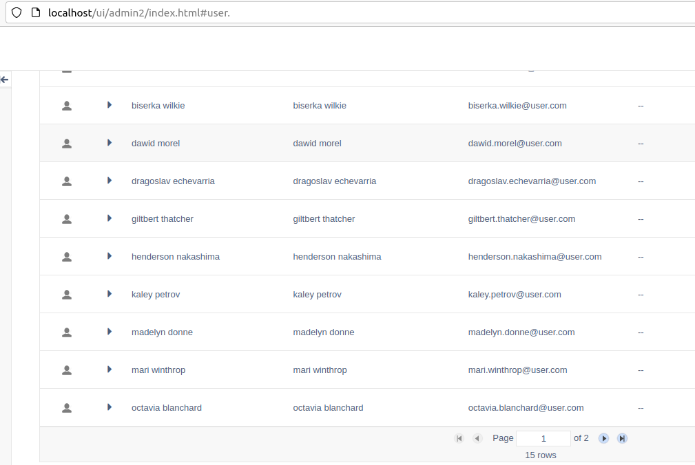
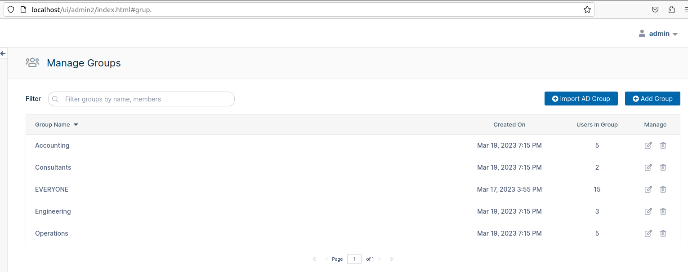
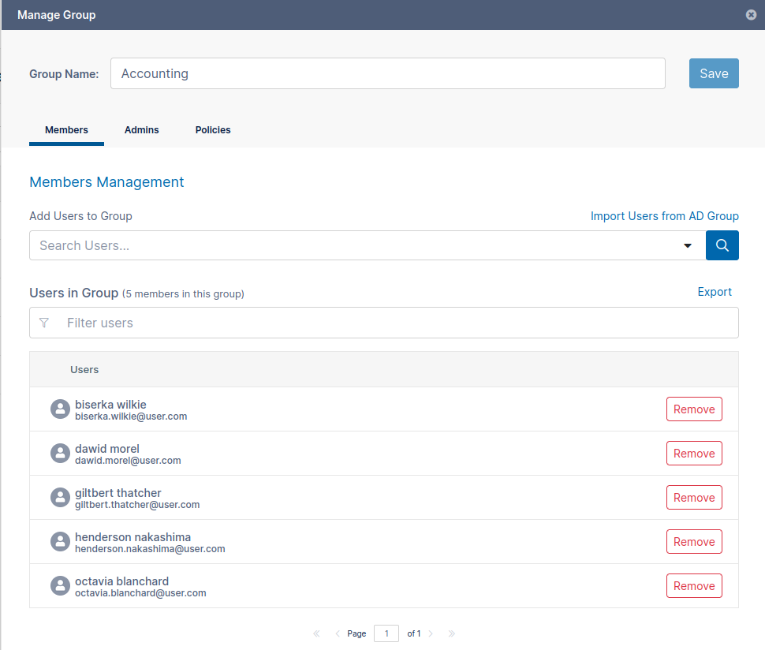

# FileCloud API Tests

## Basic description 

This project includes a series of modules to inject users and groups to the Admin through the interaction with several APIs.

This network of modules allows the administrator to parametrize file names, file locations and content, in order to make a reusable structure which can be composed in different ways.

Also, a Test module was created with the intention of exercising the different parts of all these modules. All test cases are 100% independent (no dependencies between them) repeatables (they 'undo' any change in the state of the environment, after execution) and completely decouples from any environment (they run both locally or in a remote env). 

## Prerequisites

In order to run this tool properly the following environment variables must be set
```
export CONFIG_FILE=<name of the desired config file. For instance: env.local.json
export USERS_FILE=<name of the file to store user data. For instance: users.json
export GROUPS_FILE=<name of the file to store groups data. For instance: groups.json
export USERS_PER_GROUPS_FILE=<name of the file to store the relationship between Users and Groups. For instance: users_per_groups.json
```

**NOTE**: It's important to locate any file into the config folder in this project. The Loader functions are set in that way to make the parametrization easier.

## Project dependencies
[Pytest](https://docs.pytest.org/en/7.2.x/) Test Engine, in charge of all basic plumbering to make testing possible!

[PyHamcrest](https://pyhamcrest.readthedocs.io/en/latest/) Assertion library.

[requests](https://requests.readthedocs.io/) API Client to interact with Restful APIs easily!

[xmltodict](https://github.com/martinblech/xmltodict) Small library to cast XML response bodies to Python dicts. 

## How to run the project

First, dependencies must be downloaded. Please, go to the project root and run
```
$ pip install -r requirements.txt
```

**NOTE**: A good practice in cases like this is to create a [VirtualEnv](https://virtualenv.pypa.io/en/latest/).

Then, in order to run the whole process to inject Users, Groups and the relationship between them, just run the following command:
```
$ python main.py
```

The process takes more or less a minute (depending on the target env.). Once it's finished all data will be added, like in this example (running against the local environment managed by Docker Compose)




## How to run the test cases
If you want to run the test for verification purposes, or if you are working on a modification, and you want to check if it's working as expected (you should do it! =) ), just go to the root folder and run
```
$ pytest test/
```

You should get an output like the following one

```
$ pytest tests/
=============== test session starts ===============
platform linux -- Python 3.8.10, pytest-7.2.2, pluggy-1.0.0
rootdir: /home/maggie/repositories/filecloud-api-tests/tests, configfile: pytest.ini
collected 10 items
.....
========== 10 passed in 87.07s (0:01:27) ==========
```

**NOTE**: See the full example in the output folder.


## Pending improvements
There's a lot for improvement in this solution. Just to name a few:
* Exception management.
* Negative test coverage.
* Reporting.
